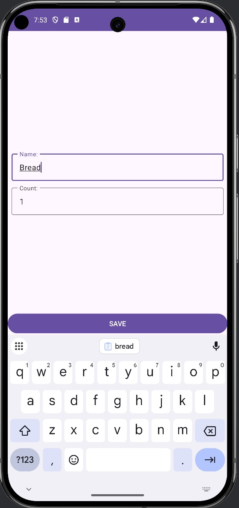
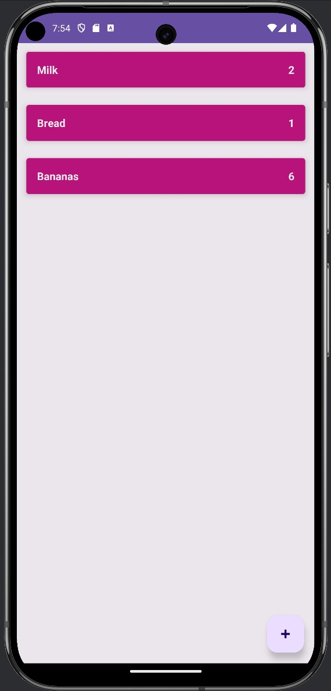
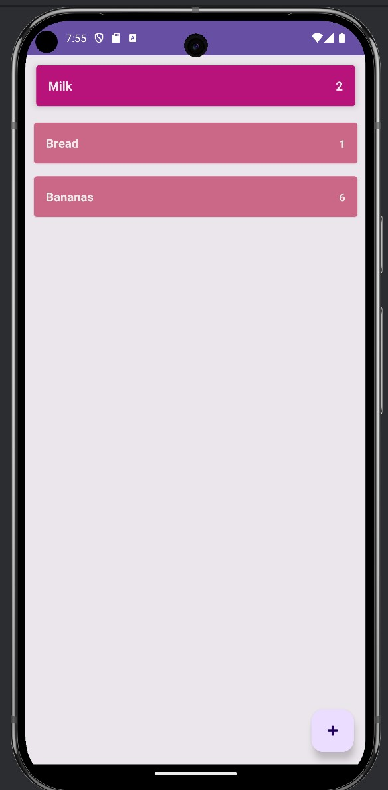

# Shopping List

## Overview
A simple Kotlin-language android app designed for shopping. Allows you to add, delete, and edit products with their quantity.

## Features
- **remove item** - deletion occurs by swiping the element to the side.
- **long click** - due to a long click, the element becomes inactive and changes its appearance.

## Tech Stack
| **Category**             | **Technologies**                  |
|--------------------------|-----------------------------------|
| **Language**             | Kotlin                            |
| **Architecture**         | Clean Architecture                |
| **Reactive Programming** | LiveData, Coroutines              |
| **Database**            | Room                             |

## Screenshots

